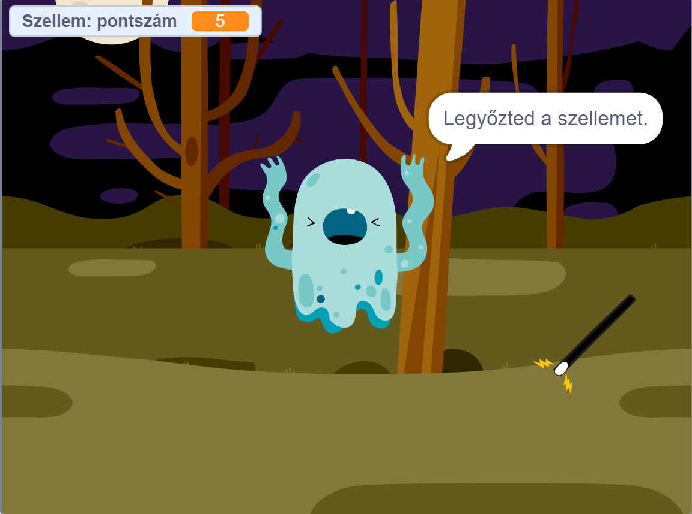

# Scratch_Game
👻 Szellemirtó - Scratch Játék
A cél minél több szellemet elkapni a varázspálcával, mielőtt azok eltűnnének.

🎮 A játék leírása

A játékban egy varázspálcát irányítasz az egérrel. A szellemek véletlenszerű helyeken bukkannak fel. Ahogy nő a pontszámod, a játék egyre nehezebb lesz: a szellemek gyorsabban váltanak helyet!

🕹️ Irányítás

Egérmozgással: A varázspálca mozgatása.

Space billentyű lenyomásával: Szellem elkapása.

🚀 Futtatás

Töltsd le a szellem_jatek.sb3 fájlt.

Nyisd meg a Scratch Online Editor oldalt.

Válaszd a File -> Load from your computer opciót és válaszd ki a letöltött fájlt.

📸 Képernyőkép

